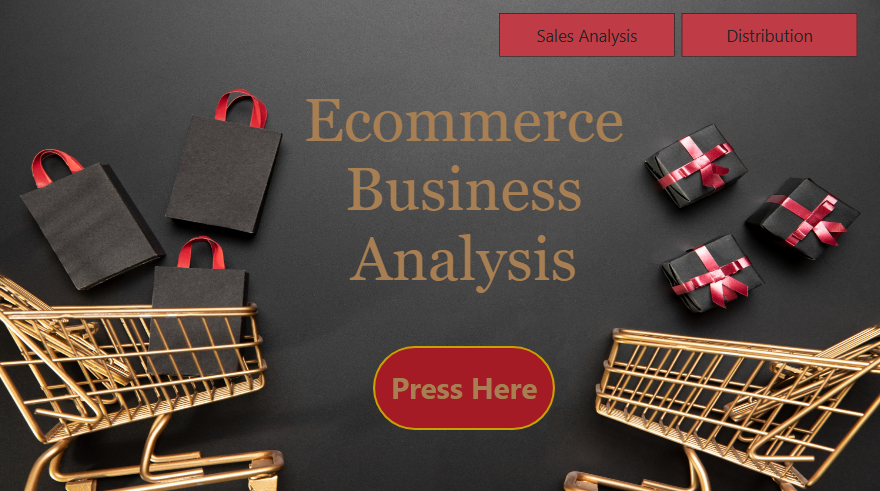
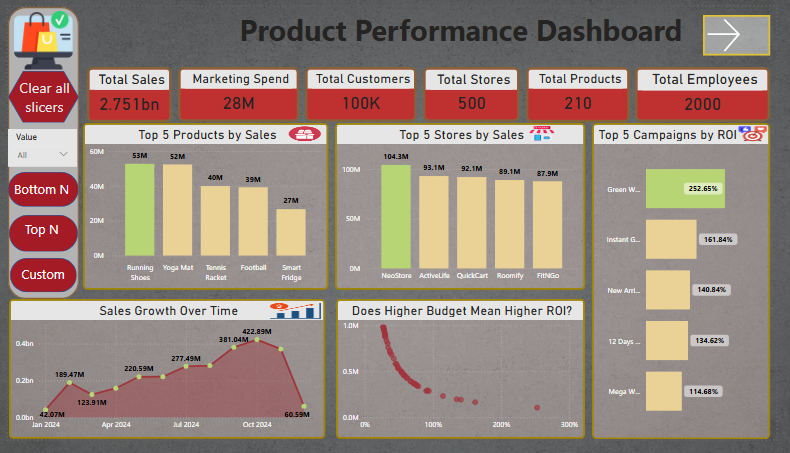
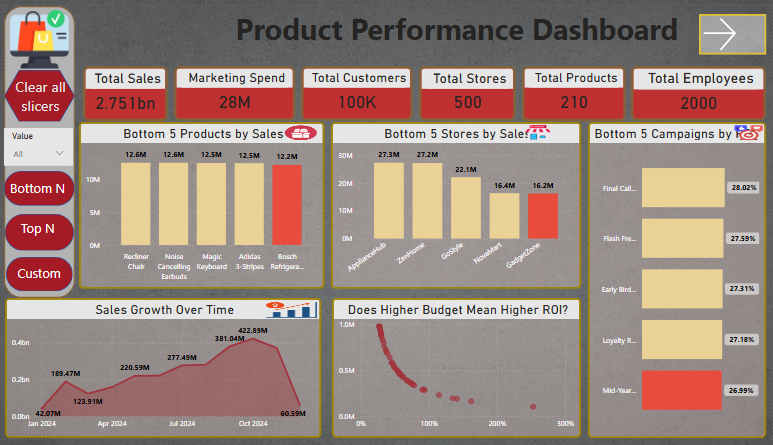
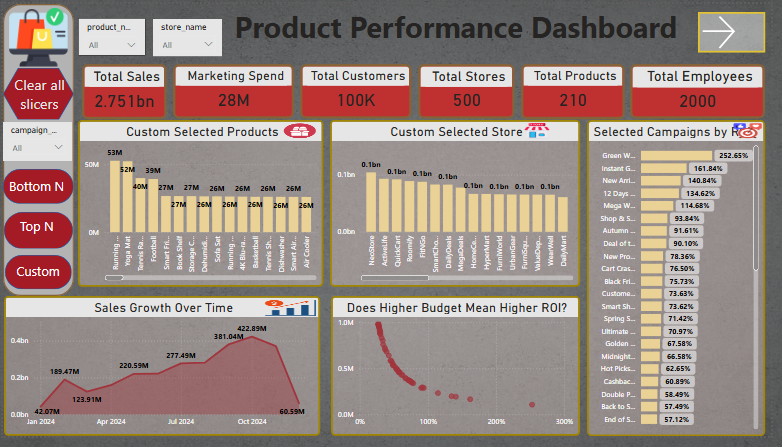
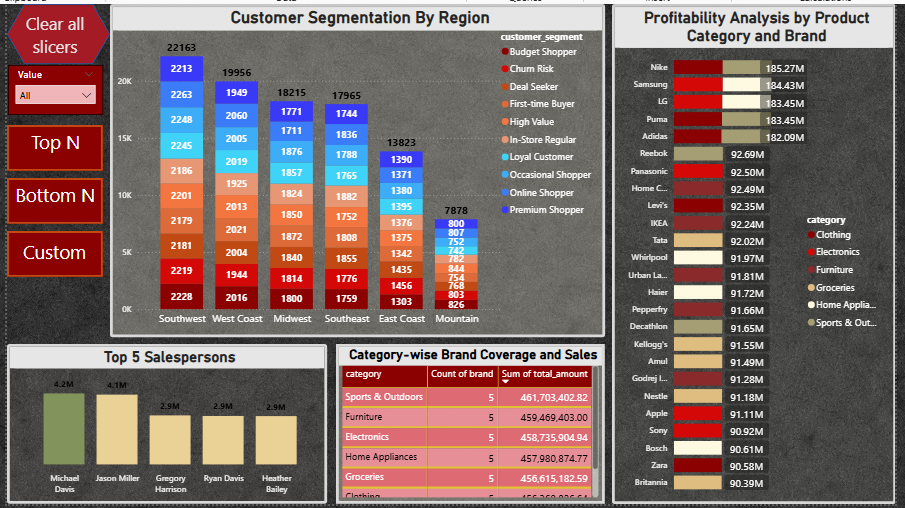

# 🛒 E-Commerce Performance Command Center
### *A Strategic Narrative through Dynamic Data Modeling*

---

## Business Problem

A mid-sized e-commerce company has $2.75B in annual sales across 500 stores, 210 products, and 2,000 employees. But their reporting is static — managers receive the same fixed tables every week. They cannot instantly see who is winning, who is failing, or compare custom selections of products or stores. This results in slow decisions, missed opportunities, and problems that fester until they become crises.

---

## Why It Matters

| Area | Impact |
|------|--------|
| **Revenue** | $2.75B at risk from underperforming products/stores going unnoticed |
| **Marketing Efficiency** | $28M annual spend with ROI ranging from 27% to 252.62% — massive reallocation opportunity |
| **Efficiency** | Managers waste 5-10 hours per week manually filtering data instead of taking action |

---

## 📖 The Story
In a high-volume e-commerce environment, a static report is a missed opportunity. Decision-makers don't just need to know "what" happened; they need to pinpoint **outliers**—the champions to reward and the red flags to fix.

This project transforms standard transactional data into a **Dynamic Narrative**. Using a custom-built "N-Factor" engine, this dashboard allows a user to switch from a high-level bird's-eye view to a surgical "Custom" analysis in a single click.

---

## Dataset

| Item | Details |
|------|---------|
| **Source** | Internal e-commerce transaction database (anonymized) |
| **Size** | 6 dimension tables + 1 normalized fact table |
| **Tables** | `dim_campaigns`, `dim_customers`, `dim_dates`, `dim_products`, `dim_sales_person`, `dim_stores`, `fact_sales` |
| **Volume** | 100K customers, 500 stores, 210 products, 2,000 salespeople, 24 months of transactions |

---

### Physical Data Model

**Fact Table:** `fact_sales`

**Dimension Tables:**
- `dim_dates` (date_key)
- `dim_products` (product_key)
- `dim_stores` (store_key)
- `dim_customers` (customer_key)
- `dim_sales_person` (sales_person_key)
- `dim_campaigns` (campaign_key)

**Relationship:** Every dimension table joins to `fact_sales` via its primary key → foreign key relationship.

**Schema Type:** Pure star schema — no many-to-many relationships, no bidirectional filters.

---

## Approach

**Step 1:** Define what users actually need — not all data, but Top winners, Bottom losers, and Custom comparisons.

**Step 2:** Build a single dynamic engine that lets users toggle between Top N, Bottom N, and Custom views with one click.

**Step 3:** Design visual hierarchy — KPI cards first (total context), then outliers (Top/Bottom lists), then supporting trends (sales over time), then deep dives (regional, churn, salespeople).

**Step 4:** Make it zero-training — titles change dynamically, colors tell the story (green = good, red = bad), and Custom mode reveals slicers only when needed.

**Step 5:** Add regional and human context — customer segmentation by region, salesperson performance, and churn risk overlays.

**Step 6:** Validate every visual with "So what?" — if a number changes, will anyone act differently?

---

## 🚀 Navigation & Experience
The journey begins at the **Interactive Home Page**, designed to minimize cognitive load and provide a "Web-App" feel.

   

> **Insight:** Users aren't forced into a maze of tabs. They choose their strategic path—**Sales Analysis** or **Distribution**—immediately upon entry.

---

## 📊 Dashboard 1: Product & Marketing Performance
*The Pulse of Revenue & ROI*

This dashboard is a dynamic engine. Using the custom sidebar, users can toggle between **Top N**, **Bottom N**, and **Custom** views. The titles and colors update instantly to reflect the data’s "mood."

### **View A: The Winners (Top N)**
*Identifying the engines of growth.*

* **🟢 Green Excellence:** Highlights the "Running Shoes" ($53M) and "NeoStore" as the primary revenue anchors.
* **Marketing Win:** The **"Green Week"** campaign is a massive outlier with a **520% ROI**, signaling a clear strategy for next quarter's budget allocation.

### **View B: The Red Flags (Bottom N)**
*Spotting leakage before it becomes a crisis.*

* **🔴 Critical Alert:** While total sales sit at $2.75bn, the **"Bosch Refrigerator"** and **"GadgetZone"** store are lagging significantly behind.
* **The Growth Story:** The "Sales Growth Over Time" chart reveals a sharp decline in late 2024, dropping from $371M to $60M. This visual prompt forces an immediate investigation into Q4 seasonality or supply chain disruptions.

### **View C: Custom Deep-Dive**
*For the surgical precision required by Category Managers.*

* **On-Demand Slicers:** Using **Bookmarks**, I implemented hidden slicer panels that only appear in Custom Mode. This keeps the interface clean while offering 100% granular control over specific product comparisons.

---

## 👥 Dashboard 2: Customer & Salesperson Analysis
*The Human Capital & Market Penetration*

* **Regional Dominance:** The **Southwest** leads in volume (22,163 customers), but the stacked bars reveal the "quality" of that volume, showing a healthy mix of **Premium** and **Loyal** shoppers.
* **Retention Risk:** The red segments represent **"Churn Risk."** By visualizing this by region, the marketing team can deploy targeted re-engagement offers to the West Coast specifically.
* **Star Performers:** Visualizing **Michael Davis** and **Jason Miller** as top sellers allows management to benchmark their performance against the "Category-wise Brand Coverage" table.

---

## ⚙️ Technical Mastery (The "How")
To deliver this level of interactivity without cluttering the report, I implemented:

* **Dynamic DAX Engines:** Created disconnected tables for `ViewMode` and `TopN_Selector` to drive visual filtering.
* **Smart Titles:** Used DAX-driven titles that change based on user slicer selection (e.g., *"Top 5 Products"* vs *"Bottom 10 Products"*).
* **Conditional Formatting Logic:** * 🟢 **Top Performers**
    * 🟡 **Intermediate Values**
    * 🔴 **Lowest Performers**
* **Optimization:** Utilized **Switch Measures** and **Bookmarks** to reduce the number of visuals per page, significantly boosting report loading speed and performance.

---

## 📽️ Full Demo
Experience the smooth transitions and interactive slicers in action:
👉 **[View the Full Dashboard Presentation](https://vimeo.com/1177020649?share=copy&fl=sv&fe=ci)**

---

### 🛠️ Tools Used
* **Power BI Desktop** (Data Modeling & UI)
* **Advanced DAX** (Dynamic Measures & Logic)
* **Power Query** (ETL & Schema Design)

- Reduces visual clutter.  
- Simplifies user interaction.  
- Improves understanding of complex datasets.  

---
